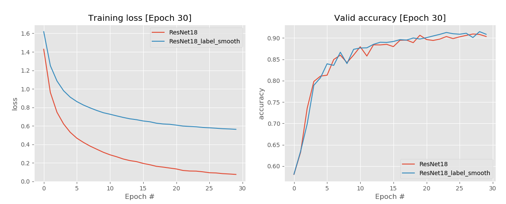
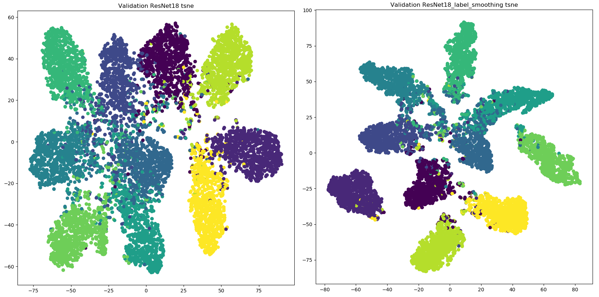

## Label Smoothing Pytorch

This repository contains a PyTorch implementation of the Label Smoothing.

## Dependencies

* PyTorch
* torchvision
* matplotlib
* scikit-learn

## Example

To produce th result, we use CIFAR-10 dataset for ResNet18.

```python
# no label smoothing
python run.py

# use label smoothing
python run.py --do_lsr

# extract feature
python generate_feature.py

python generate_feature.py --do_lsr

#----------- plot tsne
python tsne_plot.py

python tsne_plot.py --do_lsr

```
## Results

Training result



TSNE Visualisation




